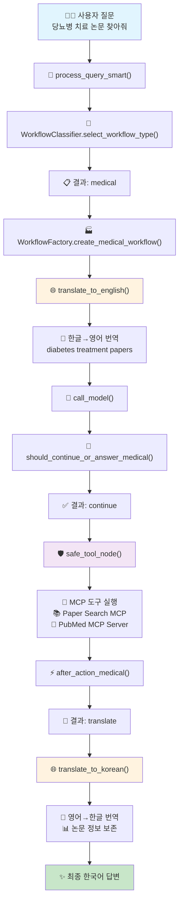
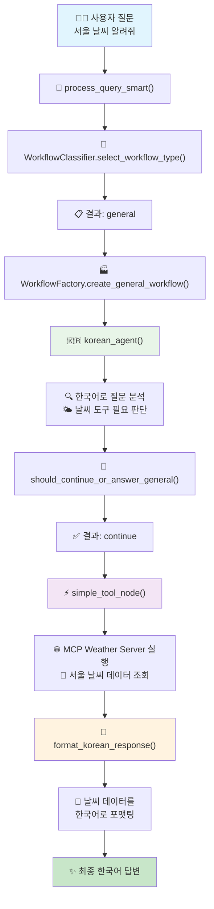
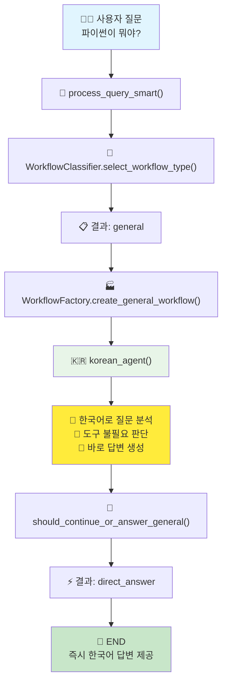
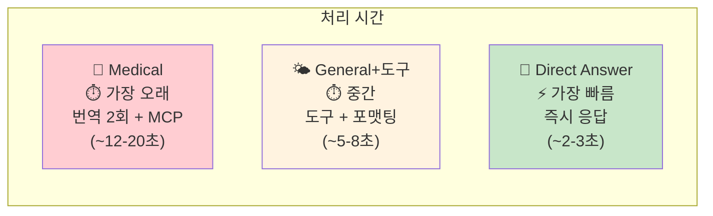
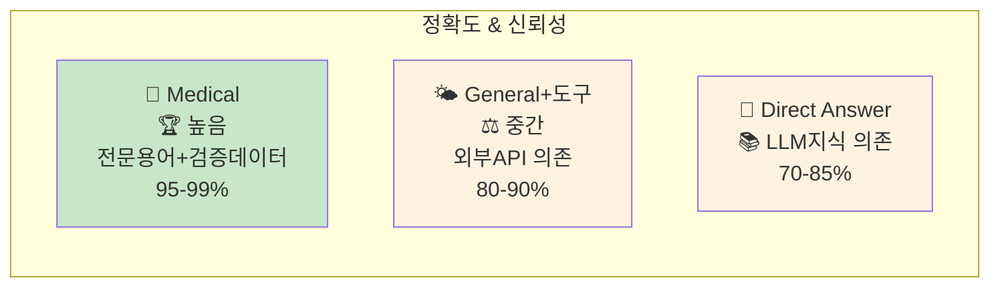

# 🏥 Medical Agent Scenario Playbook

> `medical_agent.py`의 AI 워크플로우 완전 분석 가이드

## 📋 목차

1. [개요](#개요)
2. [시나리오 1: 의료논문 질문](#시나리오-1-의료논문-질문)
3. [시나리오 2: 날씨 질문 (MCP Weather Server)](#시나리오-2-날씨-질문-mcp-weather-server)
4. [시나리오 3: 일반 상식 질문](#시나리오-3-일반-상식-질문)
5. [워크플로우 비교 분석](#워크플로우-비교-분석)
6. [핵심 함수 가이드](#핵심-함수-가이드)

---

## 📖 개요

`medical_agent.py`는 질문 유형에 따라 자동으로 최적화된 워크플로우를 선택하는 지능형 AI 에이전트입니다.

### 🔄 워크플로우 타입
- **Medical Workflow**: 의료/과학 논문 검색 전용
- **General Workflow**: 일반 질문 및 기타 도구 사용

### 🧠 자동 선택 메커니즘
```python
# WorkflowClassifier를 통한 자동 선택
workflow_type = await WorkflowClassifier.select_workflow_type(query, tools)

if workflow_type == "medical":
    workflow = WorkflowFactory.create_medical_workflow(tools, model, translator)
else:
    workflow = WorkflowFactory.create_general_workflow(tools, model, translator)
```

---

## 🔬 시나리오 1: 의료논문 질문

**예시 질문**: "당뇨병 치료에 대한 최신 연구 논문을 찾아줘"

### 📊 워크플로우 다이어그램



### 🔄 함수 호출 순서

| 순번 | 함수명 | 역할 | 소요시간 |
|------|--------|------|----------|
| 1 | `process_query_smart()` | 메인 처리 함수 | 즉시 |
| 2 | `WorkflowClassifier.select_workflow_type()` | 워크플로우 분류 | ~1초 |
| 3 | `WorkflowFactory.create_medical_workflow()` | 의료 워크플로우 생성 | 즉시 |
| 4 | `translate_to_english()` | 한글 → 영어 번역 | ~2-3초 |
| 5 | `call_model()` | LLM 도구 사용 결정 | ~1-2초 |
| 6 | `should_continue_or_answer_medical()` | 분기 결정 | 즉시 |
| 7 | `safe_tool_node()` | MCP 도구 실행 | ~5-10초 |
| 8 | `after_action_medical()` | 후처리 분기 | 즉시 |
| 9 | `translate_to_korean()` | 영어 → 한글 번역 | ~3-5초 |

### 🎯 특징
- ✅ **이중 번역**: 의료 용어 정확성 보장
- ✅ **메타데이터 보존**: PMID, DOI, 저자명 유지
- ✅ **안전한 도구 실행**: 오류 처리 및 재시도
- ✅ **높은 정확도**: 검증된 학술 데이터 기반

---

## 🌤️ 시나리오 2: 날씨 질문 (MCP Weather Server)

**예시 질문**: "서울 날씨 알려줘"

### 📊 워크플로우 다이어그램



### 🔄 함수 호출 순서

| 순번 | 함수명 | 역할 | 소요시간 |
|------|--------|------|----------|
| 1 | `process_query_smart()` | 메인 처리 함수 | 즉시 |
| 2 | `WorkflowClassifier.select_workflow_type()` | 워크플로우 분류 | ~1초 |
| 3 | `WorkflowFactory.create_general_workflow()` | 일반 워크플로우 생성 | 즉시 |
| 4 | `korean_agent()` | 한국어 질문 분석 | ~1-2초 |
| 5 | `should_continue_or_answer_general()` | 분기 결정 | 즉시 |
| 6 | `simple_tool_node()` | MCP Weather Server 실행 | ~2-3초 |
| 7 | `format_korean_response()` | 한국어 포맷팅 | ~1-2초 |

### 🎯 특징
- ✅ **빠른 처리**: 번역 과정 없이 직접 처리
- ✅ **한국어 최적화**: 네이티브 한국어 처리
- ✅ **단순한 구조**: 효율적인 도구 실행
- ✅ **확장성**: 다양한 MCP 서버 쉽게 추가 가능

---

## 💬 시나리오 3: 일반 상식 질문

**예시 질문**: "파이썬이 뭐야?" 또는 "안녕하세요"

### 📊 워크플로우 다이어그램



### 🔄 함수 호출 순서

| 순번 | 함수명 | 역할 | 소요시간 |
|------|--------|------|----------|
| 1 | `process_query_smart()` | 메인 처리 함수 | 즉시 |
| 2 | `WorkflowClassifier.select_workflow_type()` | 워크플로우 분류 | ~1초 |
| 3 | `WorkflowFactory.create_general_workflow()` | 일반 워크플로우 생성 | 즉시 |
| 4 | `korean_agent()` | 직접 답변 생성 | ~2-3초 |
| 5 | `should_continue_or_answer_general()` | 분기 결정 | 즉시 |
| 6 | **END** | 즉시 한국어 답변 제공 | - |

### 🎯 특징
- ⚡ **최고 속도**: 가장 빠른 응답 시간
- 💡 **LLM 지식 활용**: 도구 없이 즉시 답변
- 🎯 **효율성**: 최소 리소스 사용
- 💬 **자연스러운 대화**: 일상 대화에 최적화

---

## 📊 워크플로우 비교 분석

### ⏱️ 처리 시간 비교



### 💻 리소스 사용량

| 워크플로우 | CPU 사용량 | 메모리 사용량 | 네트워크 I/O | API 호출 수 |
|------------|------------|---------------|-------------|-------------|
| **Medical** | 높음 | 높음 | 높음 | 4-6회 |
| **General+도구** | 중간 | 중간 | 중간 | 2-3회 |
| **Direct Answer** | 낮음 | 낮음 | 낮음 | 1-2회 |

### 🎯 정확도 & 신뢰성



---

## 🔧 핵심 함수 가이드

### 🏭 워크플로우 관리

#### `WorkflowClassifier.select_workflow_type()`
```python
# LLM이 질문 유형을 분석하여 적절한 워크플로우 선택
workflow_type = await WorkflowClassifier.select_workflow_type(query, tools)
```
- **입력**: 사용자 질문, 사용 가능한 도구 목록
- **출력**: "medical" 또는 "general"
- **특징**: LLM 기반 지능형 분류

#### `WorkflowFactory.create_medical_workflow()`
```python
# 의료 논문 검색용 복합 워크플로우 생성
workflow = WorkflowFactory.create_medical_workflow(tools, model, translator)
```
- **노드**: translate_to_english → agent → action → translate_to_korean
- **특징**: 이중 번역, 안전한 도구 실행, 재시도 로직

#### `WorkflowFactory.create_general_workflow()`
```python
# 일반 질문용 단순 워크플로우 생성
workflow = WorkflowFactory.create_general_workflow(tools, model, translator)
```
- **노드**: korean_agent → action → format_response
- **특징**: 한국어 네이티브, 빠른 처리, 단순 구조

### 🌐 번역 시스템 (Medical 전용)

#### `translate_to_english()`
```python
# 의료 용어 특화 한→영 번역
translated_message = await translate_to_english(state, translator_model)
```
- **특징**: 의료/과학 용어 정확성, 검색 키워드 최적화
- **처리시간**: ~2-3초

#### `translate_to_korean()`
```python
# 논문 메타데이터 보존 영→한 번역
korean_message = await translate_to_korean(state, translator_model)
```
- **보존 항목**: PMID, DOI, 저자명, 저널명, 발행일
- **번역 항목**: Abstract, 설명문
- **처리시간**: ~3-5초

### 🛡️ 도구 실행 시스템

#### `safe_tool_node()` (Medical)
```python
# 안전한 MCP 도구 실행 (오류 처리 포함)
result = await safe_tool_node(state)
```
- **특징**: 예외 처리, 재시도 로직, 상태 관리
- **대상 도구**: Paper Search MCP, PubMed MCP Server

#### `simple_tool_node()` (General)
```python
# 단순한 MCP 도구 실행
result = await simple_tool_node(state)
```
- **특징**: 빠른 실행, 기본 오류 처리
- **대상 도구**: Weather Server, Calculator 등

### 🔀 분기 제어

#### `should_continue_or_answer_medical()`
```python
# 의료 워크플로우 분기 로직
next_step = should_continue_or_answer_medical(state)
# 반환값: "continue" 또는 "direct_answer"
```

#### `after_action_medical()`
```python
# 의료 워크플로우 후처리 분기
next_step = after_action_medical(state)
# 반환값: "agent" (재시도) 또는 "translate" (완료)
```

#### `should_continue_or_answer_general()`
```python
# 일반 워크플로우 분기 로직
next_step = should_continue_or_answer_general(state)
# 반환값: "continue" 또는 "direct_answer"
```

---

## 🎯 사용 권장 사항

### 🔬 Medical Workflow 사용 시
- ✅ 의료/과학 논문 검색
- ✅ 학술 연구 조사
- ✅ 전문 의학 용어 번역 필요
- ✅ 높은 정확도가 중요한 경우

### 🌤️ General Workflow (도구) 사용 시
- ✅ 날씨, 뉴스, 계산 등 일반 정보
- ✅ 외부 API 연동 필요
- ✅ 빠른 응답이 중요한 경우
- ✅ 실시간 데이터 조회

### 💬 Direct Answer 사용 시
- ✅ 일반 상식 질문
- ✅ 프로그래밍 질문
- ✅ 개념 설명
- ✅ 최고 속도가 필요한 경우

---

## 🚀 결론

`medical_agent.py`는 다음과 같은 혁신적 특징을 제공합니다:

1. **🧠 지능형 자동 분류**: 질문 유형에 따른 최적 워크플로우 자동 선택
2. **⚡ 성능 최적화**: 각 시나리오별 최적화된 처리 파이프라인
3. **🛡️ 안전성**: 강력한 오류 처리 및 재시도 메커니즘
4. **🌐 다국어 지원**: 한국어 네이티브 지원 및 전문 번역
5. **🔧 확장성**: 새로운 MCP 서버 쉽게 추가 가능

이러한 설계를 통해 의료 전문가부터 일반 사용자까지 모든 사용자에게 최적화된 AI 경험을 제공합니다! 🎉

---

*📝 작성일: 2024년*  
*🔄 버전: v1.0*  
*👨‍💻 기반: medical_agent.py* 